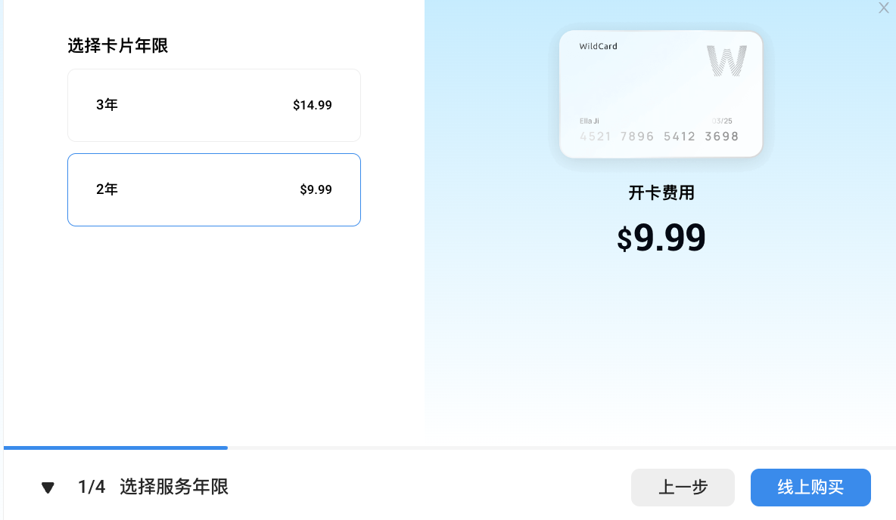
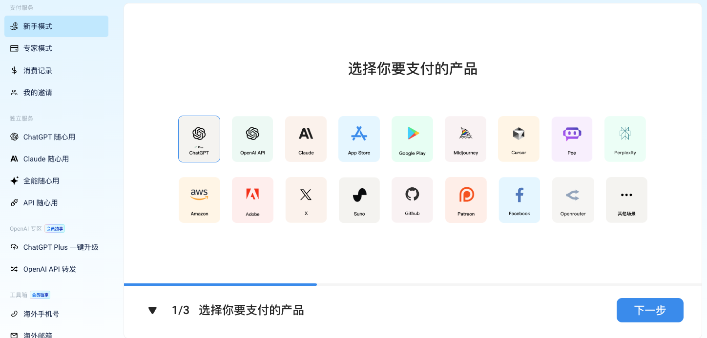
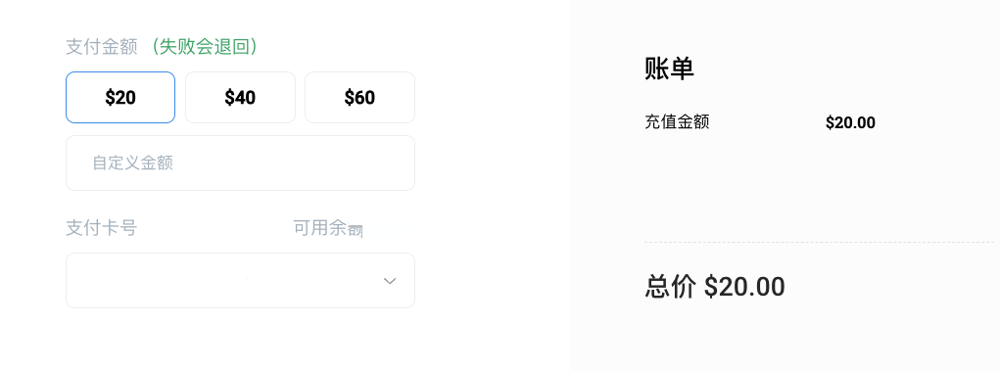
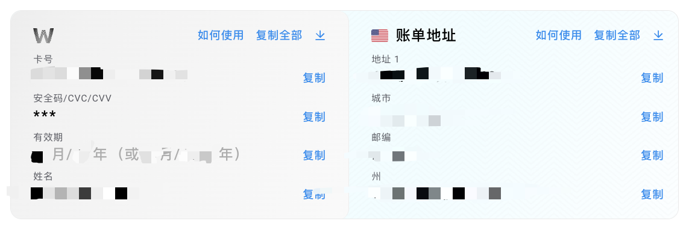
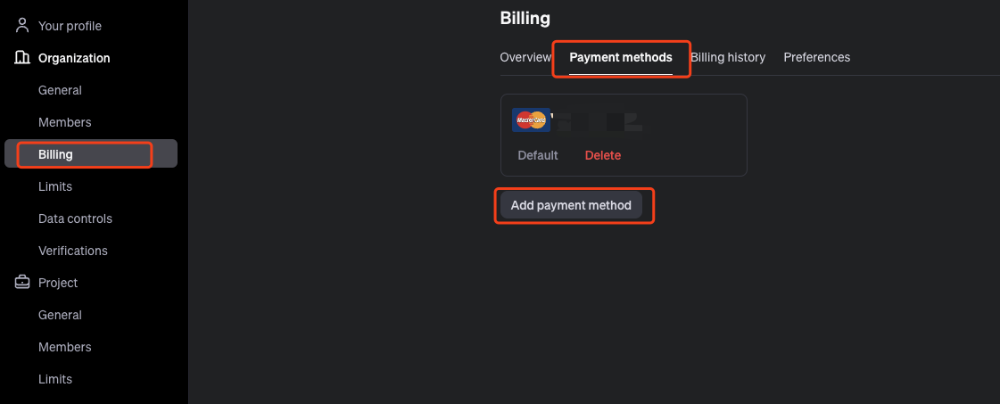
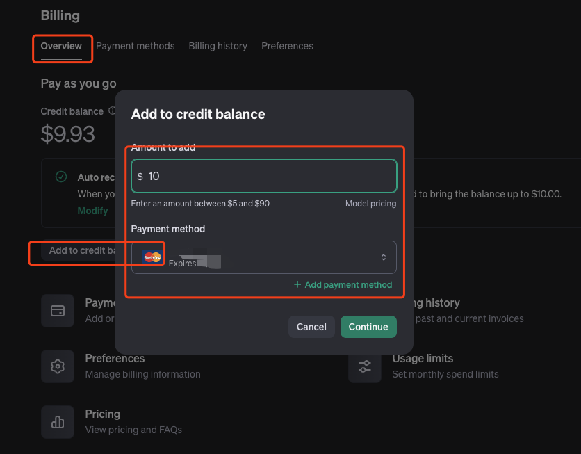

今天给大家分享一下, 我是怎么做到给 OpenAI 的 API 接口充值的. 核心思路就是使用[WildCard](https://bewildcard.com/i/ZA7XRWZ1) 创建一个新的虚拟信用卡, 往这个信用卡里充值, 之后在用这个信用卡给 OpenAI 充值.
<!--more-->
## 注册账号
这里就不细说了, 我已经注册好了.  重点还是说下开卡流程
## 开卡

第一步需要先开卡,开卡需要先花钱, 我这里就先买了 2 年的, 毕竟第一次尝试也不敢花太多钱, 另外两年时间也够折腾一阵得了, 谁知道两年之后是不是还要继续使用呢.
这不交了钱之后就选择服务就好了, 进入第二步

选择你需要的服务, 给OpenAI API充的话就选择第一行第二个, 如果是买 Plus 会员的话就选择第一行第一个, 其他的就购买对应的服务就好了. 选中之后点击下一步.

之后会让你给这个卡充钱, 这个地方充多少就都行了. 不过我冲了 20 刀. 感觉小规模使用可以用一两个月. 也一段时间不用管这个事情了.

开卡成功之后会得到下面的一个信用卡信息网页

之后我们就去 [openai](https://platform.openai.com/settings/organization/billing/overview) 网站填入这个信息
## 充值 OpenAI

在 openai的网页里找到 billing(账单) 里面的 payment methods. 这里添加一张新的银行卡, 填入之前得到的信息. 我这里已经添加过了所以会有一张卡片的信息. 
填入了信息之后就能看到这个位置有一张银行卡了. 

之后回到 Billing 的 Overview 点击  Add Credit Balance 在弹窗页面下选择银行卡,以及少量的金额(这里需要填入比充的钱少的金额以防发生错误). 点击添加即可.的
